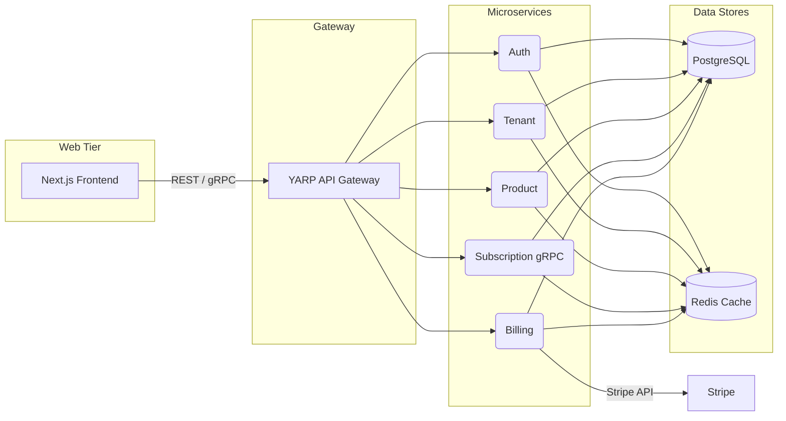

# SaaS Marketplace API Template With .NET Aspire 🚀

[](https://github.com/your-org/product-cloud/actions)
[](LICENSE.md)

A **multi-tenant** SaaS marketplace boilerplate built with **.NET 8**, **Next.js 14**, **Tailwind CSS**, and **YARP**. Perfect starter for building and open-sourcing your own SaaS marketplace.

---

## 📖 Table of Contents

* [Features](#-features)
* [Architecture](#-architecture)
* [Getting Started](#-getting-started)

  * [Prerequisites](#prerequisites)
  * [Clone & Setup](#clone--setup)
  * [Run with .NET Aspire](#run-with-dotnet-aspire)
  * [Run Frontend Only](#run-frontend-only)
* [Folder Structure](#-folder-structure)
* [Contributing](#-contributing)
* [License](#-license)

---

## 🛠️ Features

* **Multi-Tenancy**: Isolated tenant stores with customizable branding (logo, colors, timezone).
* **Microservices**:

  * **Auth Service**: OpenIddict-based auth & JWT issuance
  * **Tenant Service**: Organization onboarding & settings
  * **Product Service**: CRUD for products & plans
  * **Subscription Service**: gRPC API for subscriptions
  * **Billing Service**: Stripe integration, pre-checkout intents, idempotency
* **API Gateway**: YARP for routing, load balancing, and hot reload
* **Cache Layer**: Shared `IAppCache` abstraction using Redis
* **Frontend**: Next.js 14 (App Router) + Tailwind CSS + Storybook
* **CI/CD**: GitHub Actions workflows for build, test, and Storybook deployment

---

## 🏗️ Architecture



---

## 🚀 Getting Started

### Prerequisites

* [.NET 8 SDK](https://dotnet.microsoft.com/download)
* [Node.js 20+ & npm](https://nodejs.org/)
* [Docker](https://www.docker.com/) (for Aspire orchestration)
* Stripe account & API key

### Clone & Setup

```bash
# Clone
git clone https://github.com/your-org/product-cloud.git
cd product-cloud

# Copy sample env files
template .env files in each service and frontend:
cp .env.example .env
cp AuthService/.env.example AuthService/.env
# ...repeat for other services

# Update .env files with your settings:
# - ConnectionStrings__Redis
# - ConnectionStrings__Postgres
# - STRIPE_SECRET_KEY (in BillingService/.env)
```

### Run with .NET Aspire

```bash
dotnet aspire run
```

* Spins up YARP, Redis (with Insight), PostgreSQL, all microservices, and the Next.js app.
* Frontend: [http://localhost:3000](http://localhost:3000)
* YARP Gateway: [http://localhost:5000](http://localhost:5000)
* RedisInsight: [http://localhost:8001](http://localhost:8001)

### Run Frontend Only

```bash
cd frontend
npm install
npm run dev
```

* Next.js at [http://localhost:3000](http://localhost:3000)

---

## 📁 Folder Structure

```
/product-cloud
├─ .aspire/               # Aspire config
├─ AuthService/          # Auth microservice
├─ TenantService/        # Tenant management
├─ ProductService/       # Product catalog & plans
├─ SubscriptionService/  # gRPC subscription API
├─ BillingService/       # Stripe billing & pre-checkout
├─ frontend/             # Next.js + Tailwind app
├─ Shared/               # Shared libs: gRPC contracts, caching
├─ .github/              # GitHub Actions, issue templates
└─ docs/                 # Storybook & Docusaurus docs
```

---

## 🤝 Contributing

1. ⭐️ **Fork** the repo
2. 🛠️ **Branch**: `git checkout -b feature/your-feature`
3. ✅ **Commit**: `git commit -m "Add awesome feature"`
4. 🚚 **Push**: `git push origin feature/your-feature`
5. 🔀 **Open** a Pull Request

See [CONTRIBUTING.md](CONTRIBUTING.md) for more details.

---

## 📜 License

Distributed under the MIT License. See [LICENSE.md](LICENSE.md) for details.
